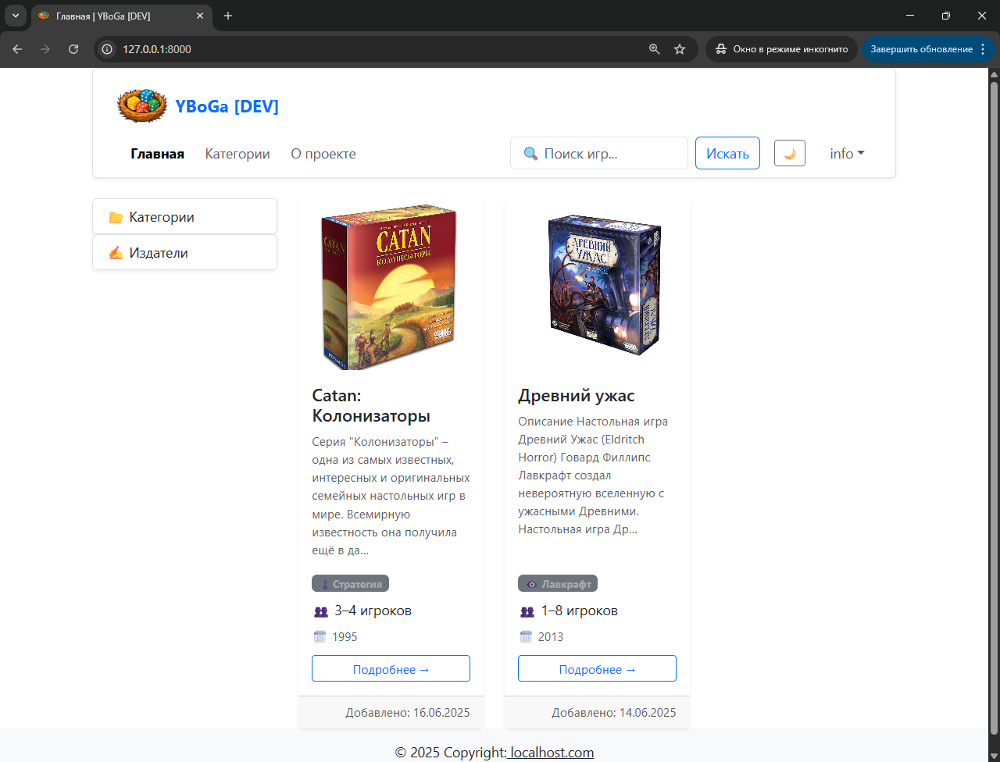

# 🎲 YBoGa — Your Board Games

Удобное веб-приложение для хранения информации о ваших настольных играх 🧩

---

## 🛠️ Возможности для админов

- ✍️ Добавление и редактирование:

    - настольных игр

    - категорий

    - издателей

- 📦 Удобное управление контентом через Django Admin

## 🌟 Возможности для пользователей

- 🧩 Просмотр карточек настольных игр с подробностями

- 📚 Группировка и навигация по категориям и издателям

- 📱 Современный адаптивный интерфейс для ПК и мобильных устройств

- 🔍 Поиск игр по названию

---

## 🖼️ Скриншоты

### Главная страница

## ⚙️ Установка

...